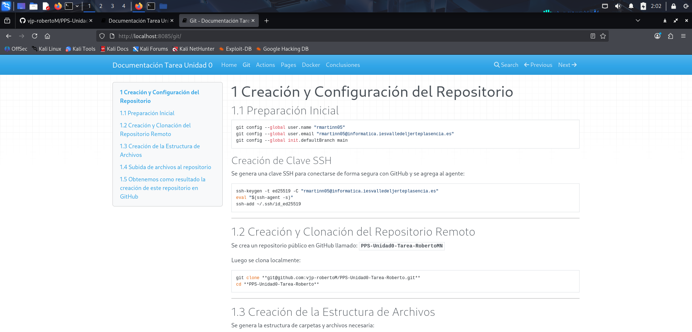

# 4 Creación de un Contenedor NGINX con Docker

## 4.1 Preparación de los archivos

Antes de crear el contenedor, es necesario cambiar a la rama `gh-pages` del repositorio:

```
cd PPS-Unidad0-Tarea-RobertoMN
git checkout gh-pages
```
## 4.2 Creación del contenedor docker

```
docker run -d \
  --name PPSUnidad0-Tarea_RobertoMN \
  -p 8085:80 \
  -v $(pwd):/usr/share/nginx/html \
  nginx
```
Explicación breve:
- `-d` → Ejecuta el contenedor en segundo plano.
- `--name` → Asigna un nombre al contenedor para identificarlo fácilmente.
- `-p 8085:80` → Mapea el puerto 80 del contenedor al 8085 de tu máquina.
- `-v $(pwd):/usr/share/nginx/html` → Monta el directorio actual (gh-pages) dentro del contenedor.
- `nginx` → Imagen oficial de NGINX de Docker Hub.


**IMPORTANTE** Si no funciona:
### 1. Eliminar cualquier contenedor antiguo

```
docker ps -a
docker stop PPSUnidad0
docker rm PPSUnidad0
```
### 2. Eliminar cualquier imagen antigua
```
docker images
docker rmi <ID_DE_LA_IMAGEN_NGINX_QUE_USASTE>
```
### 3. Limpiar caché de Docker
```
docker volume prune
```

### 4. Asegúrate de que tu carpeta gh-pages local está ACTUALIZADA
```
git fetch --all
git checkout gh-pages
git pull
git fetch --all
git checkout gh-pages
git reset --hard origin/gh-pages
```

## 4.3 Visualización de la página qeb
`http://localhost:8085`


